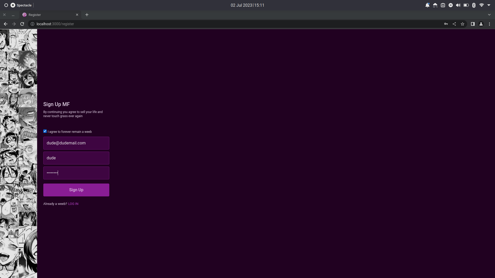
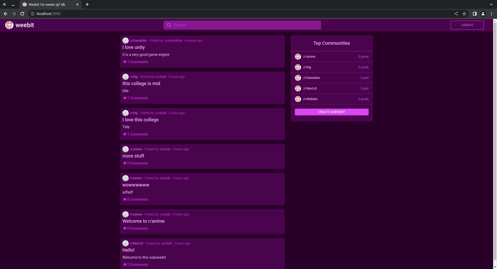
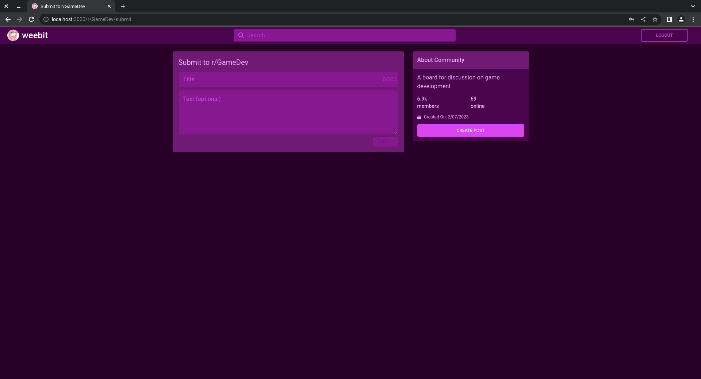
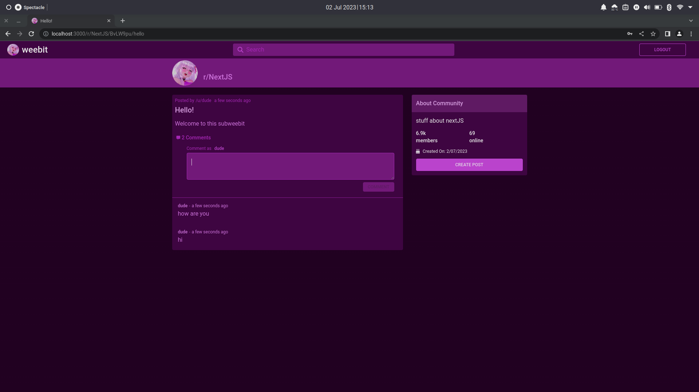
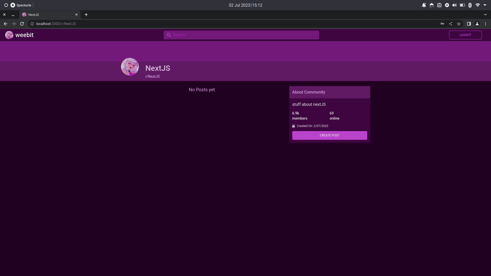
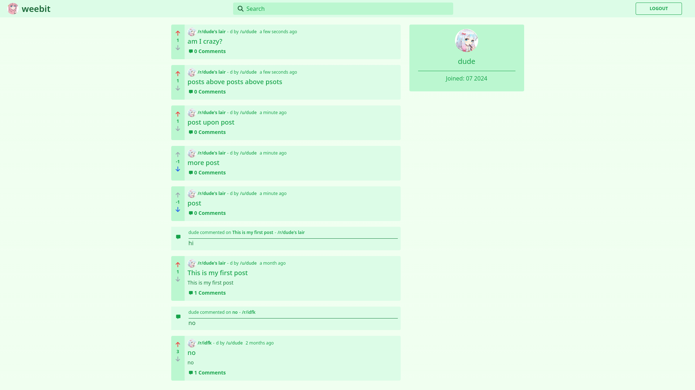

# Weebit
#### An anime-themed reddit clone made using Typeorm, express, Nextjs, TailwindCSS and SWR

### TechStack:
  **Server**: TypeORM, express

  **Client**: NextJS, Tailwind CSS and SWR
  
  **Database**: PostgreSQL

### To Run the server and client locally:
1. Run ```npm i``` command to install dependancies
2. Setup database settings inside 'data-source.ts' (use a .env file to configure, dotEnvTemplate given as reference)
3. Run ```npm run typeorm -- migration:generate src/migration/<migration_name>```
4. Run ```npm run typeorm -- migration:run```
5. Run ```npm run dev``` command to run both server and also client (***cli can be found in [package.json](package.json)***)
6. open http://localhost:3000

### Features:
* Authentication using JWT token
* Password hashed using Bcrypt
* Checks of for valid email, username and password(using class-validator)
* Optimised data fetching using SWR
* Infinite loading in home page using SWR
* Commenting functionality

### Register Page:


### Login Page:


### Home Page:


### Create subWeebit Page:


### Create Post page:


### Post Page:


### SubWeebit Page:


### User Page:


## Acknowledgements:
* [Classed](https://www.youtube.com/@Classsed) for YouTube tutorial on how to make the website