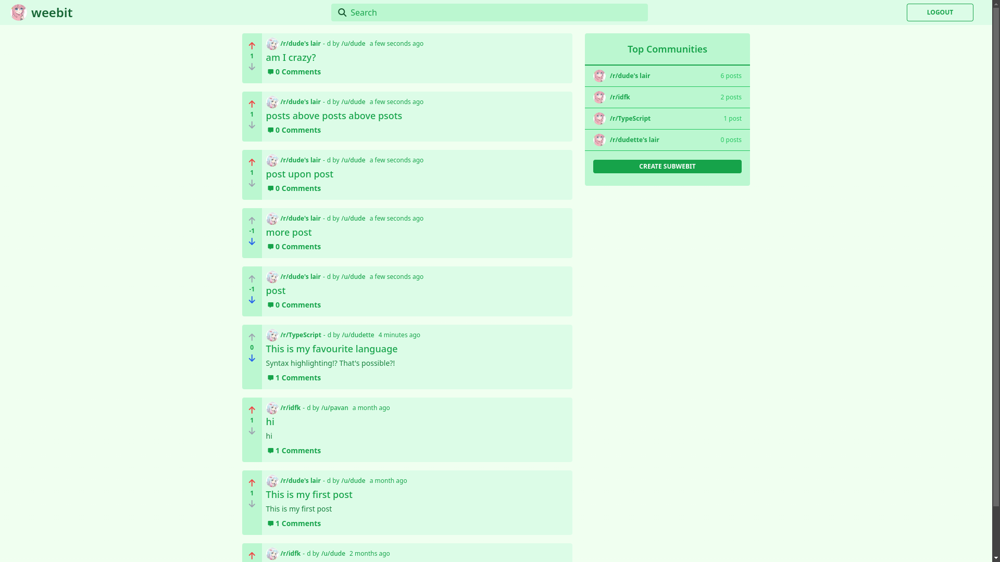
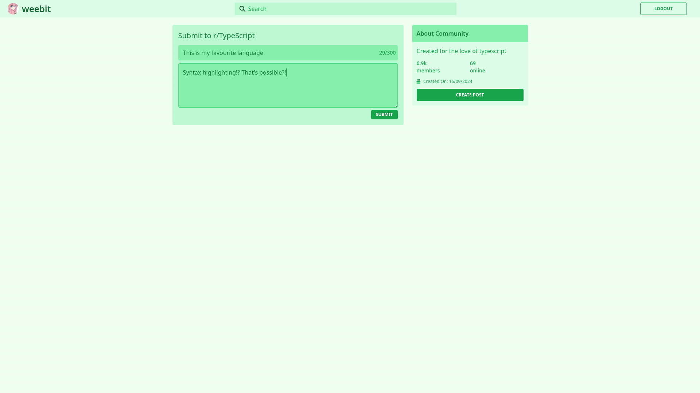
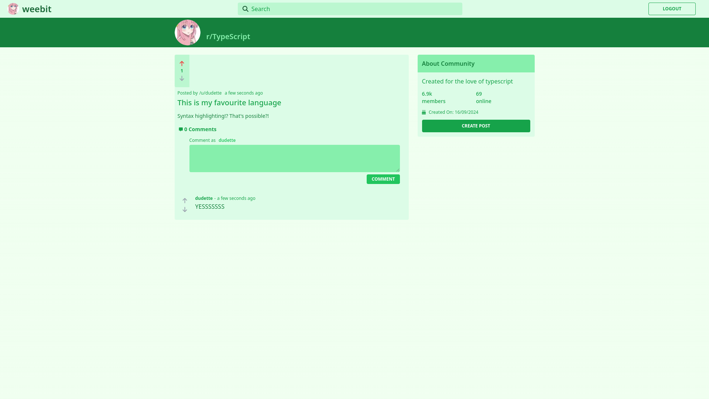
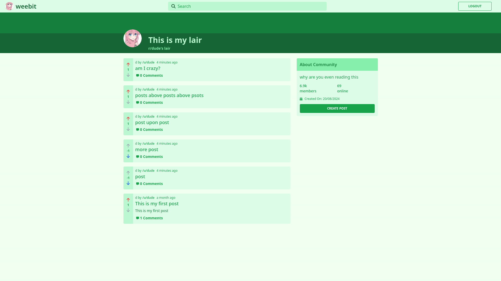

# Weebit - Online Forum App

Weebit is an online forum platform built using modern web technologies. It allows users to create and engage in discussions across various topics, offering features such as upvoting/downvoting, commenting, and more. The project utilizes a robust tech stack including TypeORM, Express, Next.js, TailwindCSS, and SWR for optimal performance and an intuitive user experience.

---

## 🚀 Tech Stack:

- **Server:** TypeORM, Express.js
- **Client:** Next.js, Tailwind CSS, SWR
- **Database:** PostgreSQL

---

## 🛠️ Running the Server and Client Locally:

1. **Install dependencies**:  
   Run the following command:
   ```bash
   npm install
   ```
2. **Database Setup**:
   Configure your database settings in `data-source.ts` by using a `.env` file. A template for `.env` is provided for reference.

3. **Generate Migrations**:
   - Generate a new Migration:
   ```bash
   npm run typeorm -- migration:generate src/migration/<migration_name>
   ```
   - Run the migration:
   ```bash
   npm run typeorm -- migration:run
   ```
4. **Start the Server and Client**:
   Run the following command to start both the server and client:

   ```bash
   npm run dev
   ```

5. **Access the webpage**:
   Open your browser and paste the following link:
   ```bash
   http://localhost:3000
   ```

---

## ✨ Features:

- **Authentication**:
  Secure authentication using JWT tokens.

- **Password Security**:
  Passwords are hashed with Bcrypt for enhanced security.

- **Validation**:
  Checks for valid email, username, and password using class-validator.

- **Optimized Data Fetching**:
  Data fetching is optimized with SWR for real-time, revalidation-friendly fetching.

- **Infinite Scrolling**:
  The homepage supports infinite loading for posts using SWR.

- **Community-Driven Features**:
  - Commenting on posts.
  - Upvoting/Downvoting posts.

---

## 📸 Screenshots:

### Register Page:


### Login Page:


### Home Page:



### Search Bar:


### Create subWeebit Page:


### Create Post page:



### Post Page:



### SubWeebit Page:



### User Page:


---

## 📝 Acknowledgements::

- **Background Image**:
  [Adobe Stock Image](/client/public/images/background.jpg)
- **Custom Icon**:
  The [icon](/client/public/icons/icon_big.png) used is made by me

---

Enjoy using Weebit, a fast and modern forum app designed for dynamic and engaging online discussions!
